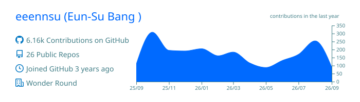

<h1> 방은수 · Eunsu Bang</h1>

웹과 모바일 앱을 만듭니다. 
실용과 편의를 기준으로 고르는 것을 선호합니다.

## Stack

**Language** — TypeScript 
**Web** — React · Next.js 
**Mobile** — React Native 
**Backend** — NestJS

## Activity

## Links

📄 [이력서](https://resume.eunsu.pro) · ✍️ [개발 블로그](https://velog.io/@diso592/posts)
